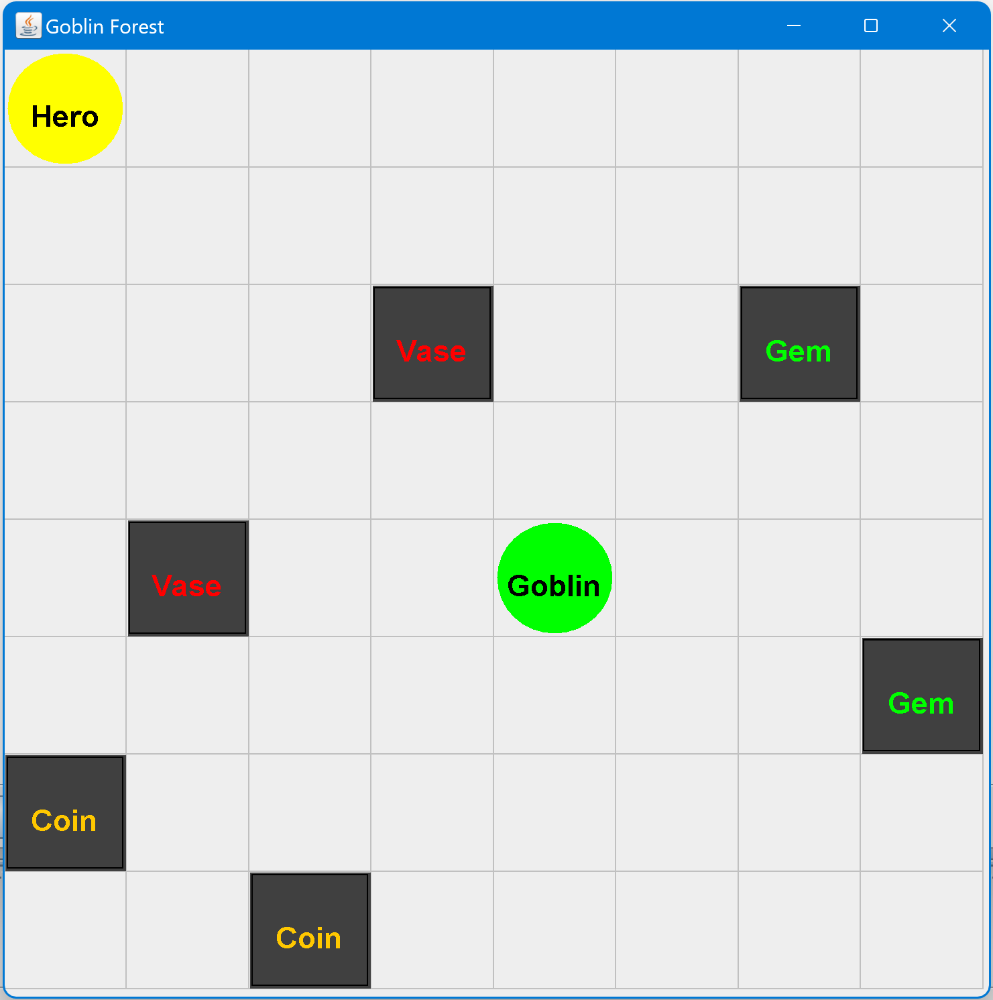
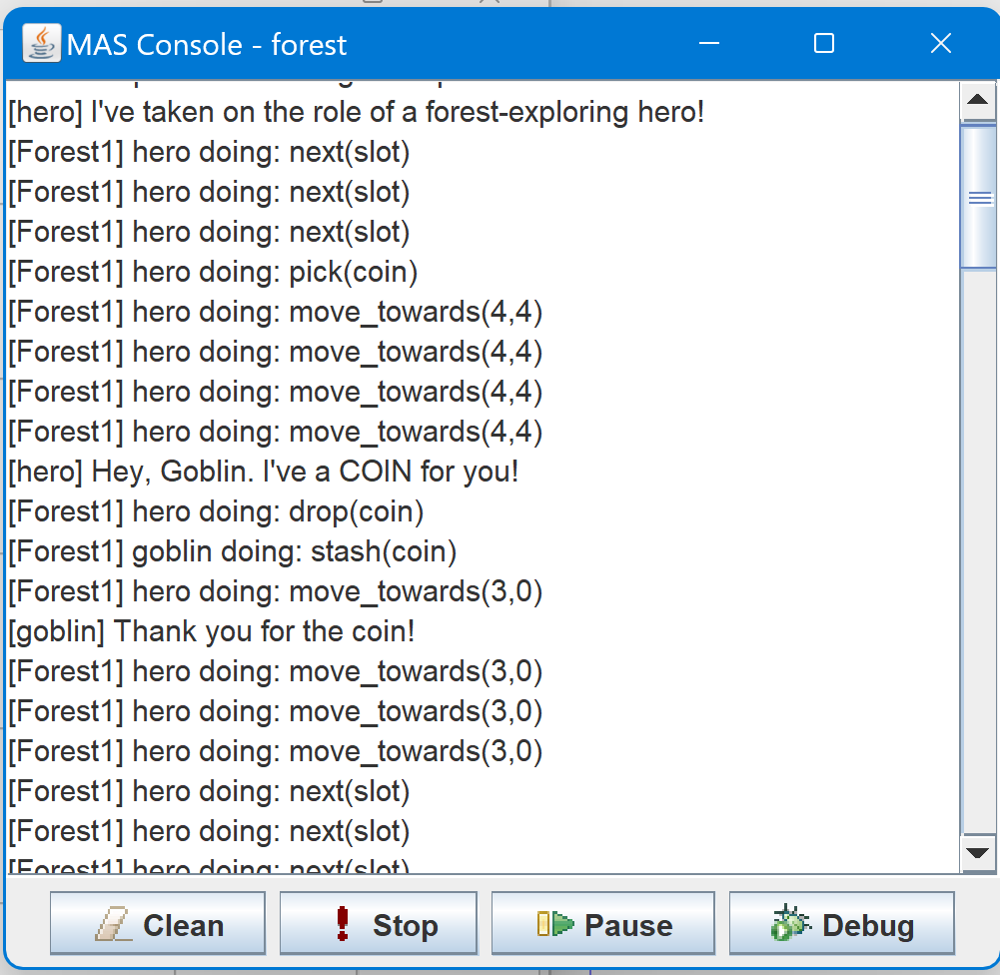

# Goblin - Hero Game

## Introduction

This is a multi-agent game implemented in AgentSpeak language and integrated into JASON IDE. In this game, you'll take on the role of a forest-exploring hero and interact with a goblin to collect items.

## Game Overview

This game takes place in various forest scenarios. The goal is for the hero agent to explore different forest environments, find different items such as **coins**, **gems**, and **vases**, and deliver them to the goblin. You can change the environment by modifying the `forest.mas2j` file to explore various environments.

## Agents

### Hero Agent

The `hero` agent is the main character in the game. It explores the forest, collects items, and delivers them to the goblin.

### Goblin Agent

There is only one `goblin` agent in the game. In order to stash things, the `goblin` agent is programmed to wait for the `hero` agent. For further information on how the goblin agent communicates with the hero agent and what items it needs to stash, please refer to the game's storyline.

## Game Environment

The game environment consists of a grid, and the hero agent starts at a specific position. Each forest scenario presents a unique set of challenges and opportunities for exploration.

## Screenshots

_**Figure 1:** A screenshot of the game environment._

_**Figure 2:** A screenshot of the log console displaying actions and messages._

## Game Rules

- The hero agent's goal is to collect items one-by-one and deliver them to the goblin.
- There are three types of items: vase, coin, and gem.
- The hero can only carry one item at a time.
- The goblin is waiting for specific items.
- The game continues until the hero has successfully explored all of the slots in the environment, collected every item, and delivered them to the goblin.

## How to Play

1. **Change Forest Scenario**: You can modify the "forest.mas2j" file to change the game environment to Forest2, Forest3, and so on for different scenarios.

2. **Explore the Forest**: The hero agent will automatically explore the forest, trying to find items.

3. **Collect Items**: When the hero finds an item, it will automatically pick it up.

4. **Deliver Items to the Goblin**: If the hero is carrying an item, it will deliver it to the goblin. Successful deliveries will trigger a message from the goblin.

5. **Repeat**: The hero will continue exploring and delivering items until all items are collected, or the hero reaches the end of the grid.

## Contributing

Feel free to fork the repository and send pull requests if you'd want to contribute to this project or make improvements to the game. Changes that improve the game's core mechanics, interface, or other features are warmly welcomed.